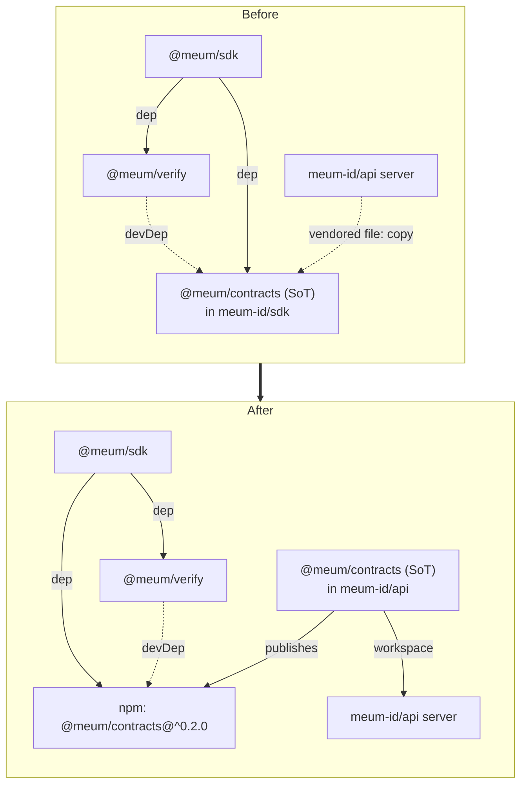

# Contracts move-out and client repoint - Plan

## Goal Capsule

**Objective.** Relocate the wire-contract source of truth (`@meum/contracts`) out of this repo, and repoint the two
client packages (`@meum/sdk`, `@meum/verify`) to consume it from the npm-published package that meum-id/api will own.
The end state leaves meum-id/sdk as the client repo (sdk + verify), with the contract sourced as a normal versioned
dependency.

**Authority hierarchy.** This plan owns the meum-id/sdk side only. The api-side migration (creating and publishing
`@meum/contracts`, the contracts-stays-zod-only guard, rewiring the server off its vendored copy) and the revoke-proof
enforcement are owned by separate plans in the meum-id/api repo — see
[Cross-Repo Dependencies and Related Plans](#cross-repo-dependencies-and-related-plans). Do not implement api-side work
here.

**Stop conditions.**

- STOP the repoint/removal units (U1–U3) if `@meum/contracts@0.2.0` is not yet published to npm — `bun install` will
  fail to resolve the dependency until it is. The guard and mock-worker-comment units (U4–U5) do not have this
  prerequisite; U6 depends on U3 and lands after the removal.
- STOP and surface if a repoint would require changing the client's public API (`MeumClient` surface). It must not — the
  only change is where the contract dependency resolves from.

**Execution profile.** Mixed sequencing. U4–U5 can land ahead of the api publish; U6 depends on U3, and U1–U3 wait on
the api publish (see Planning Contract sequencing). Keep U1–U3's `package.json`/`bun.lock` edits off the U4–U5 branch —
an unresolvable `@meum/contracts@^0.2.0` breaks `bun install --frozen-lockfile` for every unit on that branch, including
the independent ones.

---

## Product Contract

### Summary

Move `@meum/contracts` out of meum-id/sdk and repoint `@meum/sdk` and `@meum/verify` to the npm-published contract, then
delete the local copy so the repo holds only the client packages. Add a client-side dependency guard, mark the mock
Worker's route table as a mirror, and update the docs to describe the new source of truth.

### Problem Frame

The wire contract currently lives in the public meum-id/sdk repo and is consumed by the private meum-id/api server via a
vendored `file:` copy. That arrangement makes the client repo the owner of the interface and forces a manual
vendor-then-adopt step between a contract change and its server enforcement — the seam that let the revoke device-PoP
additions (`@meum/contracts` 0.2.0) land in the contract while the server stayed on a 0.1.0 vendored copy. The agreed
direction is to co-locate the contract with its reference implementation (meum-id/api), publish it as a public package,
and have both the server and the clients consume the published artifact as equals. This plan executes the meum-id/sdk
half of that move.

### Requirements

**Repoint and removal**

- R1. `@meum/sdk` consumes `@meum/contracts` from the npm-published package (`@meum` scope, `^0.2.0`) rather than the
  workspace copy; its runtime imports (`@meum/contracts/claims`, `@meum/contracts/codes`) are unchanged.
- R2. `@meum/verify`'s `@meum/contracts` devDependency resolves to the published package, and verify's
  zero-runtime-dependency property is preserved.
- R3. The local `packages/contracts` source is removed from meum-id/sdk once the published package is available; this
  repo no longer publishes `@meum/contracts`.

**Boundary and correctness**

- R4. A fail-closed dependency guard bounds the client packages' runtime surface: `@meum/verify` has zero runtime
  dependencies; `@meum/sdk` depends only on `@meum/contracts` and `@meum/verify`.
- R5. The mock Worker's route table is documented as a deliberate mirror of meum-id/api's routes, not a source of truth.

**Docs and durability**

- R6. Repo docs (README, AGENTS, CONCEPTS, the RELEASES suite, CHANGELOG) describe the contract as sourced from npm
  (published by meum-id/api) and this repo as the client (sdk + verify).
- R7. The future standalone-contracts extraction trigger is recorded durably.

### Scope Boundaries

In scope: the sdk-side move-out, repoint, client guard, mock-worker comment, and docs.

#### Deferred to Follow-Up Work

- The api-side migration and the revoke-proof enforcement — owned by the meum-id/api plans in
  [Cross-Repo Dependencies and Related Plans](#cross-repo-dependencies-and-related-plans).
- Changing how the client packages (`@meum/sdk`, `@meum/verify`) publish — they keep their current footing; this
  migration only moves where `@meum/contracts` publishes from (to meum-id/api). The clients repoint to consume it.
- Renaming the meum-id/sdk repo to reflect its client-only role — a naming cleanup, not part of this move.
- Extracting `@meum/contracts` to its own standalone repo — recorded as a trigger (R7), not executed now.

---

## Planning Contract

### Key Technical Decisions

- KTD1 — **Semver npm dependency, not a pinned exact or a vendored path.** Repoint to `"@meum/contracts": "^0.2.0"`
  resolved through the lockfile. This gives both sides a drift signal (dependabot/renovate can surface contract bumps),
  which is the durable fix for the 0.1.0/0.2.0 drift that motivated the move.
- KTD2 — **verify stays zero-runtime-dep; the repoint is devDependency-only.** `@meum/verify`'s runtime source
  deliberately re-declares the types it needs locally (`src/receipt-types.ts`, `src/jwks.ts`,
  `src/fixtures/sealed-credential-types.ts`) rather than importing `@meum/contracts`. Do not "simplify" those into
  contract imports — the zero-runtime-dep guarantee is a product property (verify ships as a dependency-free offline
  verifier).
- KTD3 — **The client repo guards only client invariants.** The contracts-stays-zod-only guard moves to the api plan
  (contracts lives there now). Here the guard covers verify = zero runtime deps and sdk = client-deps-only. Each repo
  guards its own side; there is no cross-repo guard.
- KTD4 — **Sequencing gates the repoint on the api publish.** U1–U3 require `@meum/contracts@0.2.0` live on npm; U4–U5
  are independent of that publish and can land first, while U6 depends on U3. Keep the U1–U3 manifest/lockfile edits off
  the U4–U5 branch until the contract is live — an unresolvable npm range breaks `bun install --frozen-lockfile` for the
  whole branch, so a shared branch would block the "independent" units too.
- KTD5 — **Reconcile `bun.lock` by hand, then verify frozen.** Moving a dependency from `workspace:*` to an npm range
  does not always rewrite cleanly in `bun.lock`; `release.yml` runs `bun install --frozen-lockfile`, so a stale lockfile
  fails the release. Reconcile the lockfile and confirm a frozen install passes before considering a repoint unit done.

### High-Level Technical Design

Dependency topology before and after the move, and the cross-repo ordering.

Cross-repo ordering: the meum-id/api contracts-migration plan must create and publish `@meum/contracts@0.2.0` **before**
this plan's U1–U3 can install and pass verification. U4–U5 have no such gate; U6 depends on U3.

### Assumptions

- The npm automation token for the `@meum` scope (the "npm Automation Token (@meum)" vault item) is the credential the
  api publish uses; this plan consumes the published result and does not handle the token.
- meum-id/api is the single first-party server implementation, so co-location (not a standalone repo) is the right
  structure now — consistent with the recorded extraction trigger (R7).
- The contract's development home moves from the public meum-id/sdk repo into the private meum-id/api repo, and the
  published package's npm `repository` link points there. This is accepted: keeping ongoing contract development private
  is a goal, and external consumers still get the source in the npm tarball, though they lose a browsable repo, issues,
  and history for the interface. If public visibility of the contract itself becomes a requirement, that is a second
  trigger for the R7 standalone-repo extraction, alongside a second server implementation.

---

## Cross-Repo Dependencies and Related Plans

All api tasks below must be completed; they live in the meum-id/api repo, not here.

- **Plan #2 — meum-id/api: contracts migration (api side).** Path (being written): `meum-id/api
  docs/plans/2026-07-15-001-feat-contracts-migration-plan.md`. Blocks U1–U3 of this plan — it publishes
  `@meum/contracts` to npm, which this plan's repoint depends on. Create `packages/contracts` in meum-id/api from this
  repo's current 0.2.0 source, moving `src/` **and** `test/` (the schema regression suite — `keys`/`predicate`/`schemas`
  tests) so the contract's coverage travels with it rather than being deleted by U3; set the package
  `repository`/`directory` fields to the api repo; enable npm publish for `@meum/contracts` (public, `@meum` scope,
  using the vault token). **Acceptance criterion the sdk repoint (U1) depends on:** the published package preserves the
  exact `exports` subpath map (`.`, `./claims`, `./codes`, `./ids`) and ships sources that resolve the values behind
  them (`NAMED_CLAIMS`, `MAX_CONJUNCTION_SIZE`, `ERROR_CODES`) — no build step that collapses subpaths or drops types.
  Add the dependency-guard-in-api (contracts stays zod-only, no server deps); rewire the server to consume the local
  workspace contracts and drop `vendor/meum-sdk/packages/contracts`; align the served OpenAPI `info.version` with the
  contract version and own the reshaped alignment guard — post-move, "vendored version == advertised version" becomes
  "served `info.version` matches the local `@meum/contracts` package version." Record the standalone-repo extraction
  trigger as an ADR here, since the contract now lives in this repo.
- **Plan #3 — meum-id/api: revoke-proof (0.2.0) enforcement.** EXISTS at `meum-id/api
  docs/plans/2026-07-14-002-feat-revoke-device-pop-verify-plan.md` (status: active, implementation-ready). Implements
  device proof-of-possession validation on `POST /v1/keys/{kid}/revoke` against the 0.2.0 `RevokeProofPayload` contract.
  Its scope consumes `@meum/contracts` by re-vendoring — the current model, not the owned-package model Plan #2
  introduces; it does not own the reshaped alignment guard, which moves to Plan #2 above.

**Reconciliation.** The api's contract-consumption model changes mid-stream: Plan #3 (revoke-verify) is scoped against
the current re-vendor model, while Plan #2 (migration) replaces vendoring with an owned, published package and rewires
the server off the vendored copy, superseding Plan #3's re-vendor step once it lands. Recommended order (**Order A**):
Plan #3 first (re-vendor `@meum/contracts@0.2.0`, unblocks prod) → Plan #2 second (rewires the server onto the published
package, superseding the re-vendor) → this plan's U1–U3 third (repoint to the same published package). This plan is
downstream of both Plan #2 and Plan #3.

---

## Implementation Units

### U1. Repoint `@meum/sdk` to the published `@meum/contracts`

- **Goal:** `@meum/sdk` resolves `@meum/contracts` from npm instead of the workspace.
- **Requirements:** R1.
- **Dependencies:** Plan #2 published `@meum/contracts@0.2.0` to npm.
- **Files:** `packages/sdk/package.json`, `bun.lock`.
- **Approach:** Change `dependencies["@meum/contracts"]` from `"workspace:*"` to `"^0.2.0"`; leave `"@meum/verify":
  "workspace:*"`. The runtime imports in `packages/sdk/src/client.ts` (`@meum/contracts/claims`) and
  `packages/sdk/src/errors.ts` (`@meum/contracts/codes`) are unchanged — same package name, now resolved from npm.
  Reconcile `bun.lock` per KTD5.
- **Patterns to follow:** existing subpath-import usage in `client.ts` / `errors.ts`.
- **Test scenarios:**
- Happy: existing sdk suite stays green — `createSession` request/response, error mapping through `ERROR_CODES`, and
  claims usage all resolve the contract from npm.
- Edge: the bundle-size test (`packages/sdk/test/bundle-size.test.ts`) still reports under 50 KB gzipped.
- Integration: a full `bun install --frozen-lockfile` at the workspace root resolves `@meum/contracts` from
  `node_modules`, not a workspace symlink.
- **Verification:** frozen install succeeds; `bun run typecheck` and `bun test` green; the resolved `@meum/contracts`
  exposes the same `exports` subpath map the removed local package did (`.`, `./claims`, `./codes`, `./ids`) so
  `@meum/contracts/claims` and `/codes` resolve — a name match is not enough (see the Plan #2 acceptance criterion).

### U2. Repoint `@meum/verify`'s devDependency to the published `@meum/contracts`

- **Goal:** verify's `@meum/contracts` devDependency resolves from npm; zero runtime deps preserved.
- **Requirements:** R2.
- **Dependencies:** Plan #2 published `@meum/contracts@0.2.0`.
- **Files:** `packages/verify/package.json`, `bun.lock`.
- **Approach:** Change `devDependencies["@meum/contracts"]` from `"workspace:*"` to `"^0.2.0"`. Make no runtime `src/`
  changes — verify re-declares its types locally (KTD2). Confirm the fixtures, mock Worker, and tests that reference the
  contract in dev still resolve.
- **Test scenarios:**
- Happy: verify suite green — fixtures, mock Worker, and `verify()` behavior unchanged.
- Edge: `@meum/verify`'s manifest still declares no `dependencies` key (runtime deps empty); the noble/miniflare devDeps
  are untouched.
- **Verification:** `bun test` green; verify package has no runtime `dependencies`.

### U3. Remove the local `packages/contracts` from meum-id/sdk

- **Goal:** delete the now-duplicate contract source so this repo neither holds nor publishes `@meum/contracts`.
- **Requirements:** R3.
- **Dependencies:** U1, U2 (consumers repointed first).
- **Files:** delete `packages/contracts/`; reconcile `bun.lock`. No root `package.json` edit needed — `workspaces:
  ["packages/*"]` globs, and `release.yml` iterates `packages/*/`, so removal drops contracts from both automatically.
- **Approach:** Remove the directory, reconcile the lockfile, and confirm no live code path imports from a local
  `@meum/contracts` (only docs references remain, updated in U6).
- **Test scenarios:** Test expectation: none for the deletion itself — proven by U1/U2 suites staying green with the
  directory absent, plus a clean workspace `bun install --frozen-lockfile` + `bun test`.
- **Verification:** full workspace install and test suite green with `packages/contracts` absent; `rg
  "packages/contracts"` finds only historical doc references (addressed in U6), no live code.

### U4. Add the client-side dependency-boundary guard

- **Goal:** a fail-closed test asserting the client packages' runtime dependency surface.
- **Requirements:** R4.
- **Dependencies:** none (can land before the repoint).
- **Files:** `packages/verify/test/dependency-boundary.test.ts` (new).
- **Approach:** Read each client `package.json` and assert `dependencies` is a subset of an allowlist: `@meum/verify` →
  empty; `@meum/sdk` → `{@meum/contracts, @meum/verify}`. Fail closed when any other runtime dep appears (an
  HTTP/OpenAPI/server package such as `hono` or `@hono/zod-openapi` is the failure this guards against). Do not assert
  on `devDependencies`. Mirror the assertion-test shape of `packages/sdk/test/bundle-size.test.ts`. The
  contracts-stays-zod-only assertion is intentionally absent here — it belongs to the api plan (KTD3).
- **Test scenarios:**
- Happy: current manifests pass.
- Error: a fixture manifest object with a forbidden runtime dep (e.g., `hono` added to sdk deps) fails the assertion.
- Edge: verify's `@noble/*` + `miniflare` devDeps do not trip the runtime allowlist.
- **Verification:** `bun test` green; adding a forbidden runtime dep turns it red.

### U5. Document the mock Worker's route table as a mirror

- **Goal:** mark the route dispatch table as a deliberate mirror of meum-id/api's routes.
- **Requirements:** R5.
- **Dependencies:** none.
- **Files:** `packages/verify/src/mock-worker.ts`.
- **Approach:** Add a short WHY comment at the dispatch table: it is a hand-maintained offline-fixture mirror of
  meum-id/api's real routes (the source of truth); drift is expected and the table is updated when the api's routes
  change. Present-state comment, no history narration.
- **Test scenarios:** Test expectation: none — comment only, no behavior change.
- **Verification:** comment present; existing mock-worker tests unchanged and green.

### U6. Update repo docs and record the extraction trigger

- **Goal:** docs describe the contract as sourced from npm (published by meum-id/api) and this repo as the client; the
  extraction trigger is recorded.
- **Requirements:** R6, R7.
- **Dependencies:** U3 (docs describe the post-removal state).
- **Files:** `README.md`, `AGENTS.md`, `CONCEPTS.md`, `RELEASES.md` (and `RELEASES-PREFLIGHT.md` /
  `RELEASES-POSTFLIGHT.md` / `RELEASES-RATIONALE.md` where they enumerate packages). Not `CHANGELOG.md` — it is a
  generated artifact (`scripts/generate-changelog.py` aggregates PR `## Changelog` bullets and drift-checks the result);
  route the changelog entry through this work's PR body, never a hand edit.
- **Approach:** Update the package inventory (two client packages published from here, not three), the contract-seam
  description (the wire contract lives in and publishes from meum-id/api; this repo consumes it), the consumption
  guidance, and the release narrative. Add a durable note of the extraction trigger — extract `@meum/contracts` to its
  own repo when a second independent server implementation appears — and cross-reference that the canonical ADR lives in
  the meum-id/api plan. Write present-state docs with no change-narration, per repo doc policy.
- **Test scenarios:** Test expectation: none — docs; the markdownlint PostToolUse hook passes.
- **Verification:** docs describe present state accurately; no stale reference treats `packages/contracts` as a local
  package; markdownlint clean.

---

## Verification Contract

- **Commands:** `bun install --frozen-lockfile`, `bun run typecheck` (the repo's `build`), `bun test`, `bun run lint`
  (biome).
- **Gates:** full workspace suite green with `packages/contracts` absent and clients repointed; `@meum/sdk` bundle under
  50 KB gzipped; the client dependency-boundary guard green; markdownlint clean.
- **Cross-repo gate:** U1–U3 cannot pass until `@meum/contracts@0.2.0` is live on npm (Plan #2). Until then a frozen
  install cannot resolve the dependency, so do not commit U1–U3's manifest/lockfile edits to a branch expected to pass
  CI. Land U4–U5 (no such gate) on their own branch first; cut the U1–U3 branch after the contract is published.

---

## Definition of Done

**Global.**

- `@meum/sdk` and `@meum/verify` resolve `@meum/contracts` from the published npm package; `packages/contracts` is
  removed from this repo and no longer published here.
- The client dependency-boundary guard passes and fails closed on a forbidden runtime dep.
- The mock Worker's route table carries the mirror comment.
- Docs describe the contract as npm-sourced and this repo as the client; the extraction trigger is recorded.
- Full workspace verification is green against the published contract, with no dead references to the removed package
  and no abandoned experimental code left in the diff.

**Per-unit.** Each unit's Verification is satisfied; U1–U3 are validated only after the api publish; U4–U5 stand on
their own; U6 depends on U3.

---

## Risks & Dependencies

- **Hard cross-repo prerequisite.** The api must create and publish `@meum/contracts@0.2.0` (Plan #2) before this plan
  can pass. Coordinate the sdk change so it lands after the contract is live on npm.
- **Lockfile reconciliation.** Moving `@meum/contracts` from `workspace:*` to an npm range needs a hand-reconciled
  `bun.lock`; the frozen-install step in `release.yml` catches drift (KTD5).
- **Consumer impact — interim hybrid install model.** Relying parties (`meum-id/api`, `meum-id/ios`) vendor meum-id/sdk
  at a `sdk-v*` tag and resolve `@meum/contracts` through a `file:`/`overrides` recipe. After the repoint the clients
  are still vendored-by-tag but `@meum/contracts` resolves from npm, so consumers must drop the `file:` override for the
  contract and have npm reachable. This hybrid (clients vendored, contract from npm) is a deliberate consequence of
  deferring client publishing; U6 updates the README consumer recipe, and the next sdk tag is cut only once the contract
  is live on npm.
- **Naming lag.** The repo keeps the `meum-id/sdk` name though it is now client-only; a rename is deferred and out of
  scope.
- **Publish path may be unproven.** `release.yml` publishes on a `v*` tag, but the repo's release tags are `sdk-v*` and
  `NPM_TOKEN` is still a TODO, so `@meum/contracts@0.2.0` may never have actually published to npm. Confirm the
  package/version is claimable (and reconcile the `sdk-v*` tag scheme against the workflow's `v*` trigger) before Plan
  #2 assumes it can publish `0.2.0`.
